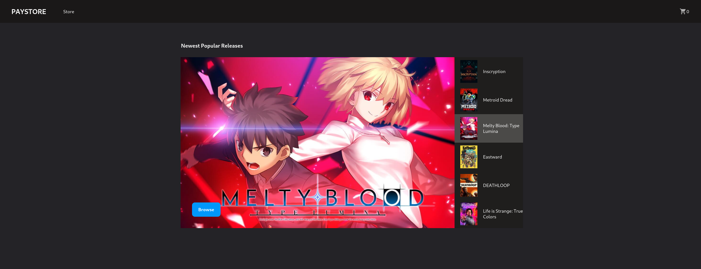

# [TheOdinProject](https://www.theodinproject.com/)

## Project: Shopping-Cart

A react project built with typescript and utilized react-router-dom to create routes.

Incorporates [IGDB](https://api-docs.igdb.com/) as Third-Party API.

**Built with**: Typescript and React

**Icons used**: [React Material Icons](https://material-ui.com/components/material-icons/)

**Proxy server**: Changed from [https://cors.bridged.cc](https://cors.bridged.cc) to my own proxy due to its new API key requirement.

If you want to know more about Bridged CC, then head to this [blog](https://blog.grida.co/cors-anywhere-for-everyone-free-reliable-cors-proxy-service-73507192714e) for more information.

## Features

- Routing
- Cart
- Interactive image UI

## Installation

This app uses environment variables and is not meant to be installed. Please visit the demo site or view source code to know more about details.

## Demo

[Live Demo](https://alberinea.github.io/shopping-cart)
